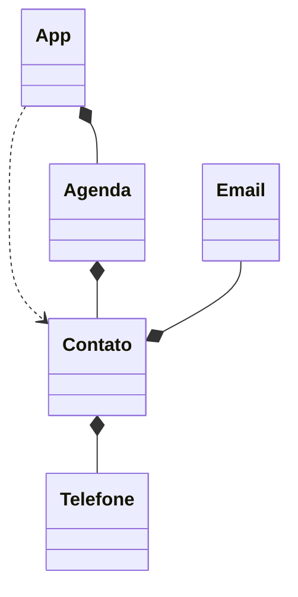

    // A: lista de contatos, fazer ações;
    // C: nome, sobrenome, aniversario;
    // E: email; add remove update
    // T: telefone; add remove update tostring
    // add, remove, update, listar dados de 1 contato, listar todos os contatos
    // rotulo de id & valor para todo email  ou telefone
    // não pode ter email invalido
    // tostring telefone +aa (aa) a aaaa-aaaa
    // listar contados exibe nome completo, aniversario, telefone e email de cada
    // telefones e emails devem ser exibidos com rotulo de id