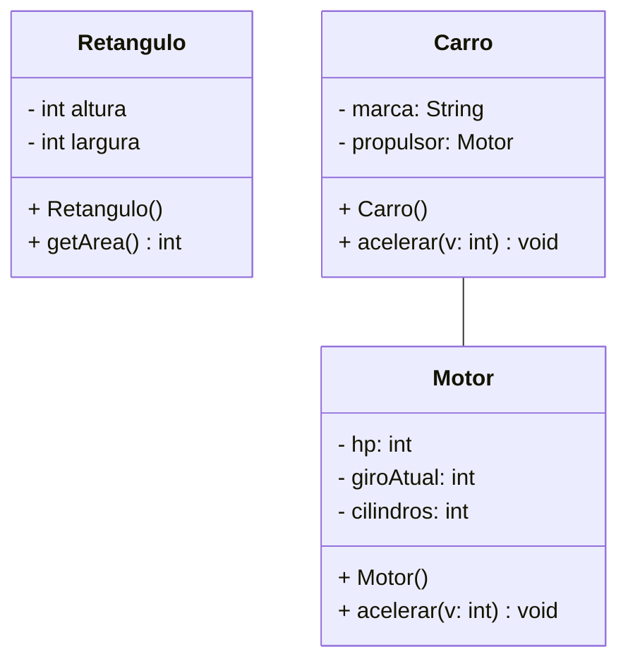

# Diagrama de Classe UML

```mermaid
classDiagram

    class Retangulo{
        - int altura
        - int largura
        + Retangulo ()    
        + getArea() int  
    }

    class Carro{
        - marca: String
        - propulsor: Motor
        + Carro()
        + acelerar(v: int) void
    }
    Carro -- Motor
    class Motor{
        - hp: int
        - giroAtual: int
        - cilindros: int
        + Motor()
        + acelerar(v: int) void
    }
```