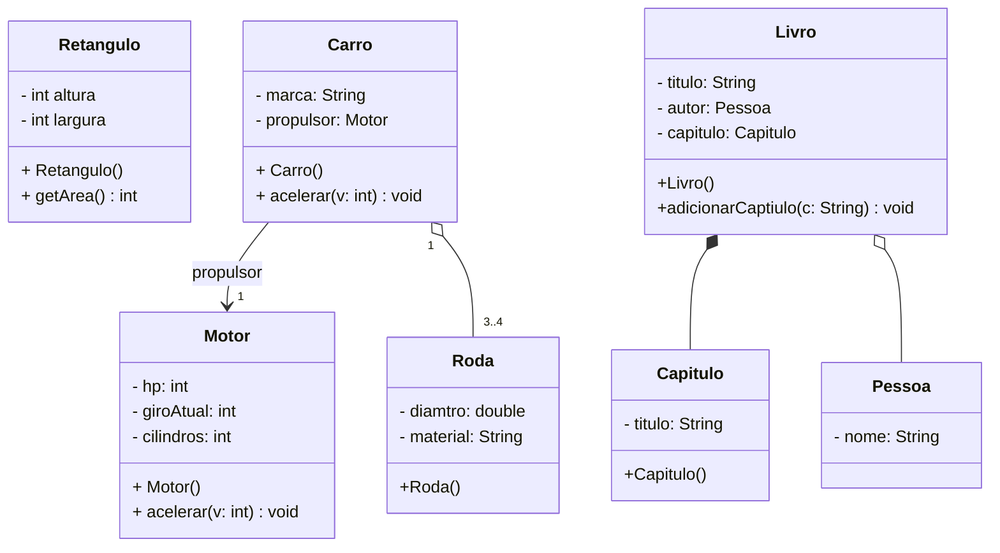
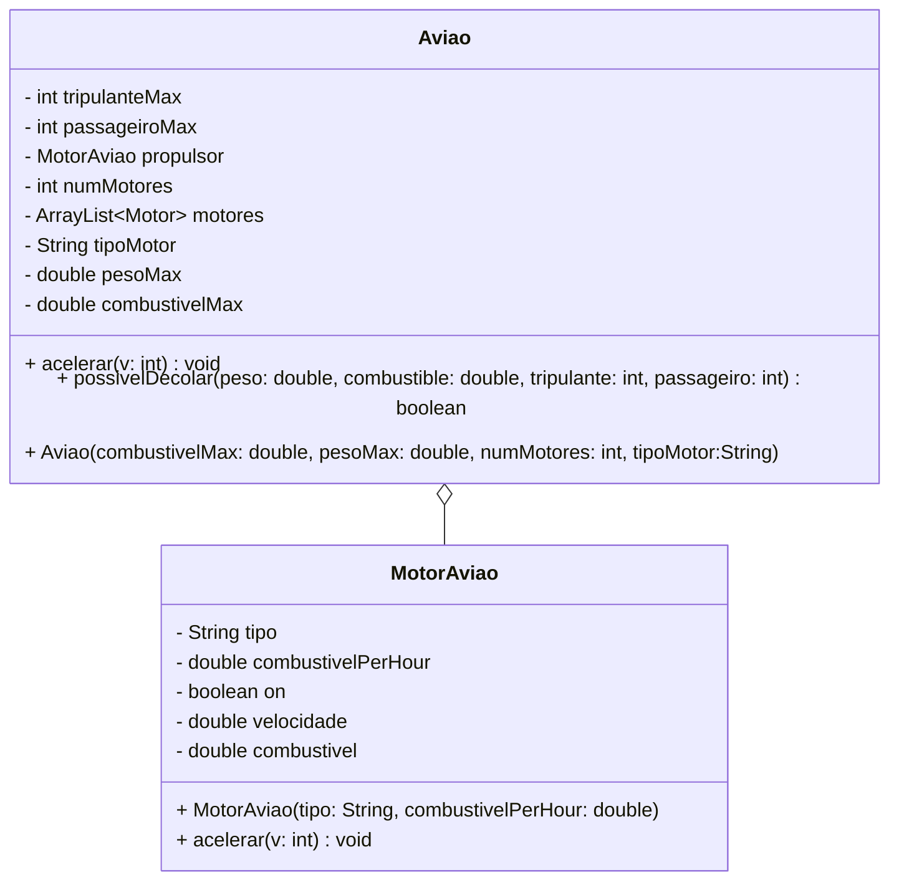

# Diagrama de Classe UML

```mermaid
classDiagram
    class Retangulo{
        - int altura
        - int largura
        + Retangulo ()    
        + getArea() int  
    }
    Carro -->"1"Motor : propulsor
    Carro "1"o--"3..4" Roda

    class Carro{
        - marca: String
        - propulsor: Motor
        + Carro()
        + acelerar(v: int) void
    }
    class Motor{
        - hp: int
        - giroAtual: int
        - cilindros: int
        + Motor()
        + acelerar(v: int) void
    }
    class Roda{
        - diamtro: double
        +Roda()
        - material: String
    }

    Livro *-- Capitulo
    Livro o-- Pessoa
    class Livro{
        - titulo: String
        - autor: Pessoa
        - capitulo: Capitulo
        +Livro()
        +adicionarCaptiulo(c: String) void
    }
    class Pessoa {
        - nome: String
    }
    class Capitulo{
        - titulo: String
        +Capitulo()
    }
```

```mermaid
classDiagram
    class Aviao{
        - int tripulanteMax
        - int passageiroMax
        - MotorAviao propulsor
        - int numMotores
        - ArrayList~Motor~ motores
        - String tipoMotor
        - double pesoMax
        - double combustivelMax
        + acelerar(v: int) void
        + possivelDecolar(peso: double, combustible: double, tripulante: int, passageiro: int) boolean
        + Aviao(combustivelMax: double, pesoMax: double, numMotores: int, tipoMotor:String)
    }
    Aviao o-- MotorAviao
    class MotorAviao{
        - String tipo
        - double combustivelPerHour
        - boolean on
        - double velocidade
        - double combustivel
        + MotorAviao(tipo: String, combustivelPerHour: double)
        + acelerar(v: int) void
    }
```