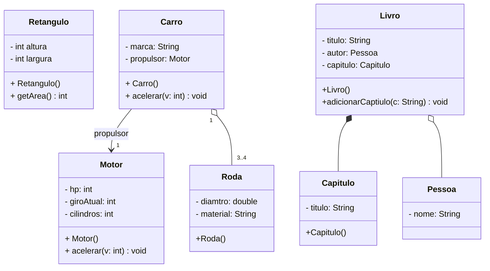

# Diagrama de Classe UML

```mermaid
classDiagram

    class Retangulo{
        - int altura
        - int largura
        + Retangulo ()    
        + getArea() int  
    }
    Carro -->"1"Motor : propulsor
    Carro "1"o--"3..4" Roda

    class Carro{
        - marca: String
        - propulsor: Motor
        + Carro()
        + acelerar(v: int) void
    }
    class Motor{
        - hp: int
        - giroAtual: int
        - cilindros: int
        + Motor()
        + acelerar(v: int) void
    }
    class Roda{
        - diamtro: double
        +Roda()
        - material: String
    }

    Livro *-- Capitulo
    Livro o-- Pessoa
    class Livro{
        - titulo: String
        - autor: Pessoa
        - capitulo: Capitulo
        +Livro()
        +adicionarCaptiulo(c: String) void
    }
    class Pessoa {
        - nome: String
    }
    class Capitulo{
        - titulo: String
        +Capitulo()
    }
```