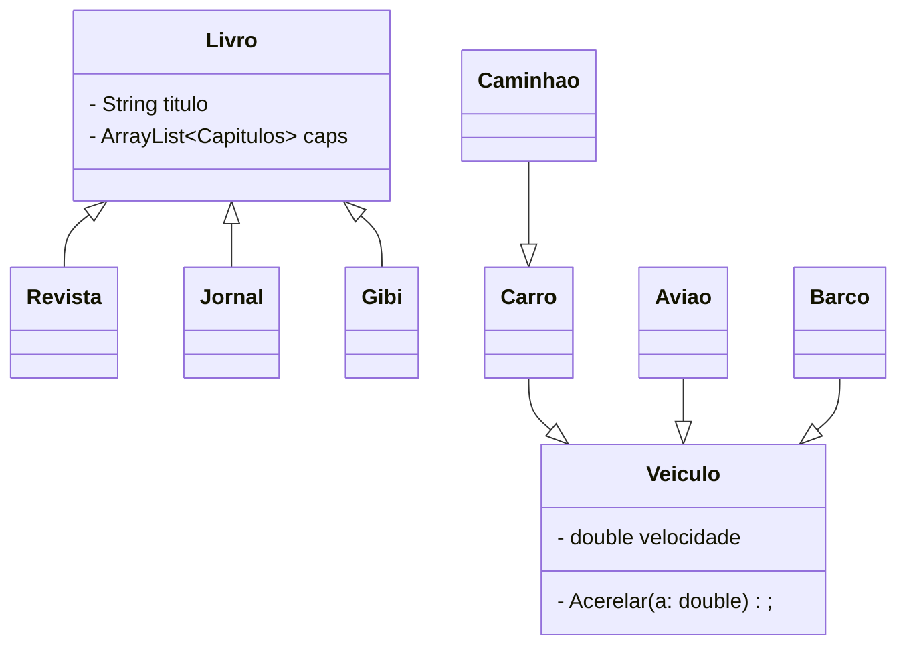
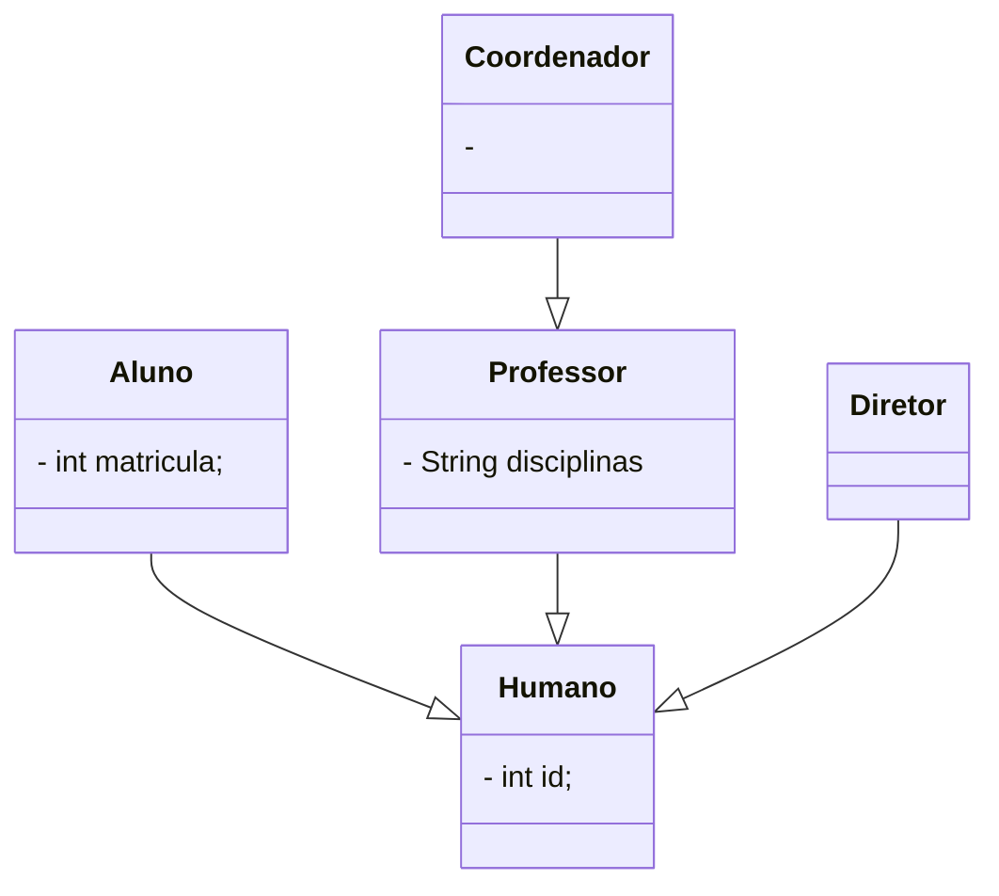
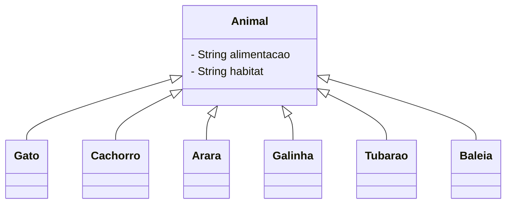

```mermaid
classDiagram
    Livro <|-- Revista
    Livro <|-- Jornal
    Livro <|-- Gibi
    Carro --|> Veiculo
    Aviao --|> Veiculo
    Barco --|> Veiculo
    Caminhao --|> Carro
    class Veiculo{
        - double velocidade
        - Acerelar(a: double);
    }
    class Livro {
        - String titulo
        - ArrayList~Capitulos~ caps
    }
```

```mermaid
classDiagram
    class Humano{
        - int id;
    }
    class Aluno{
        - int matricula;
    }
    class Professor{
        - String disciplinas
    }
    class Coordenador{
        -
    }
    class Diretor{

    }
    Aluno --|> Humano
    Professor --|> Humano
    Coordenador --|> Professor
    Diretor --|> Humano
```

```mermaid
classDiagram
    Animal <|-- Gato
    Animal <|-- Cachorro
    Animal <|-- Arara
    Animal <|-- Galinha
    Animal <|-- Tubarao
    Animal <|-- Baleia
    class Gato {

    }
    class Cachorro {
        
    }
    class Arara {
        
    }
    class Galinha {
        
    }
    class Tubarao {
        
    }
    class Baleia {
        
    }
    class Animal {
        - String alimentacao
        - String habitat
    }
```

Animais tem filo, classe, ordem, familia, as heranças definiriam genero e especie, imagino eu.