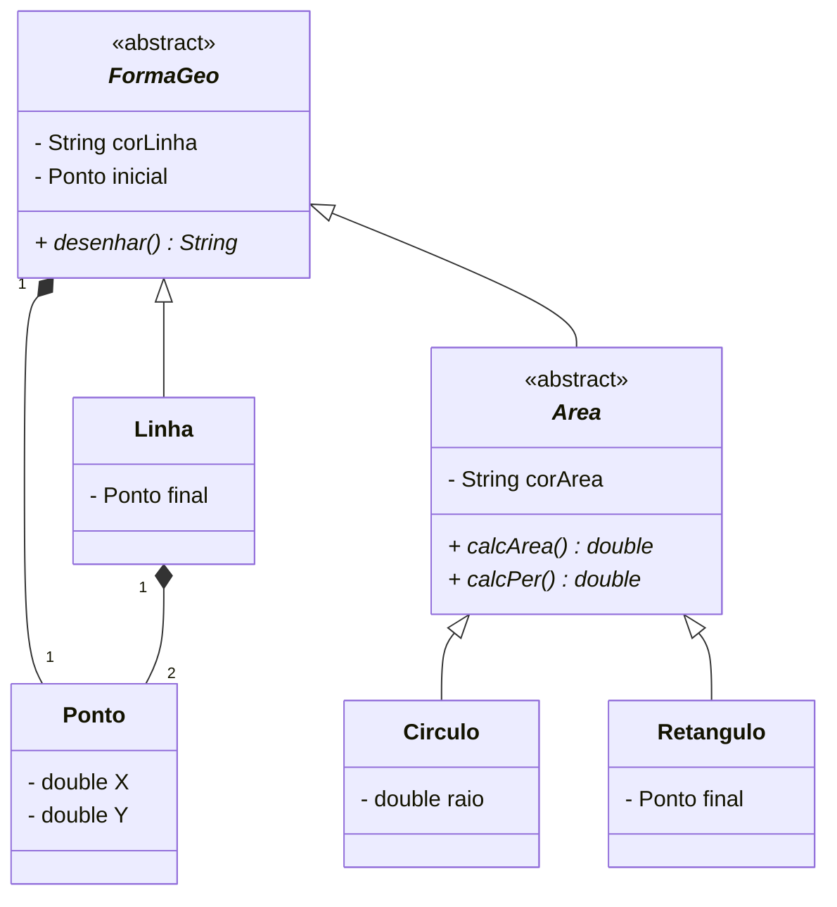

```mermaid
classDiagram
class _FormaGeo_{
    <<abstract>>
    - String corLinha
    - Ponto inicial
    + desenhar () String*
}
_FormaGeo_ "1"*--"1" Ponto
_FormaGeo_ <|-- _Area_
_FormaGeo_ <|-- Linha
Linha "1"*--"2" Ponto
_Area_ <|-- Circulo
_Area_ <|-- Retangulo
class Ponto{
    - double X
    - double Y
}
class Linha{
    - Ponto final
}
class _Area_ {
    <<abstract>>
    - String corArea
    + calcArea () double*
    + calcPer () double*
}
class Circulo{
    - double raio
}
class Retangulo{
    - Ponto final
}
```