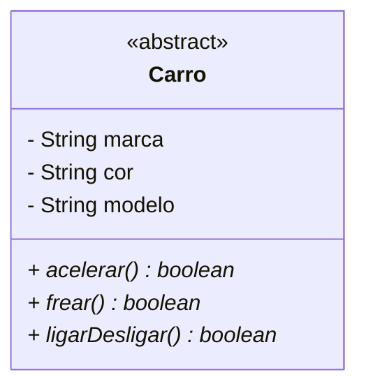

Um fabricante de jogo de corrida gostaria de permitir que seu jogo fosse estendido por outras pessoas de forma que possam criar seus próprios carros
Deve-se garantir que todos os carros possuam os mesmos métodos: acelerar, frear, ligar e desligar
Cada carro pode ter um comportamento diferente ao acelerar, frear e ligar/desligar
Cada carro pode ser de uma marca diferente, ter cor diferente e um modelo diferente