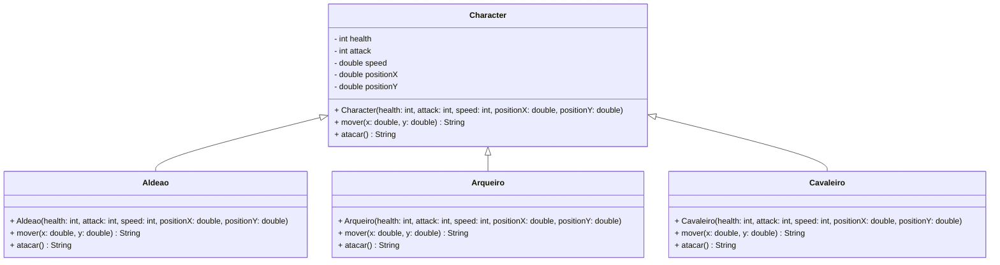

```mermaid
classDiagram
    class Character{
        + Character (health: int, attack: int, speed: int, positionX: double, positionY: double)
        - int health
        - int attack
        - double speed
        - double positionX
        - double positionY
        + mover (x: double, y: double) String
        + atacar () String
    }
    Character <|-- Aldeao
    Character <|-- Arqueiro
    Character <|-- Cavaleiro
    class Aldeao{
        + Aldeao (health: int, attack: int, speed: int, positionX: double, positionY: double)
        + mover (x: double, y: double) String
        + atacar () String
    }
    class Arqueiro{
        + Arqueiro (health: int, attack: int, speed: int, positionX: double, positionY: double)
        + mover (x: double, y: double) String
        + atacar () String
    }
    class Cavaleiro{
        + Cavaleiro (health: int, attack: int, speed: int, positionX: double, positionY: double)
        + mover (x: double, y: double) String
        + atacar () String
    }
```