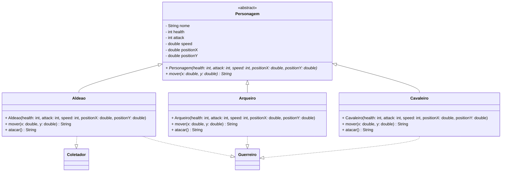

```mermaid
classDiagram
    class Personagem{
        <<abstract>>
        + Personagem (health: int, attack: int, speed: int, positionX: double, positionY: double)*
        - String nome
        - int health
        - int attack
        - double speed
        - double positionX
        - double positionY
        + mover (x: double, y: double) String*
    }
    Personagem <|-- Aldeao
    Personagem <|-- Arqueiro
    Personagem <|-- Cavaleiro
    Aldeao ..|>Coletador
    Aldeao ..|>Guerreiro
    Arqueiro ..|>Guerreiro
    Cavaleiro ..|>Guerreiro
    class Guerreiro
    class Coletador
    class Aldeao{
        + Aldeao (health: int, attack: int, speed: int, positionX: double, positionY: double)
        + mover (x: double, y: double) String
        + atacar () String
    }
    class Arqueiro{
        + Arqueiro (health: int, attack: int, speed: int, positionX: double, positionY: double)
        + mover (x: double, y: double) String
        + atacar () String
    }
    class Cavaleiro{
        + Cavaleiro (health: int, attack: int, speed: int, positionX: double, positionY: double)
        + mover (x: double, y: double) String
        + atacar () String
    }
```