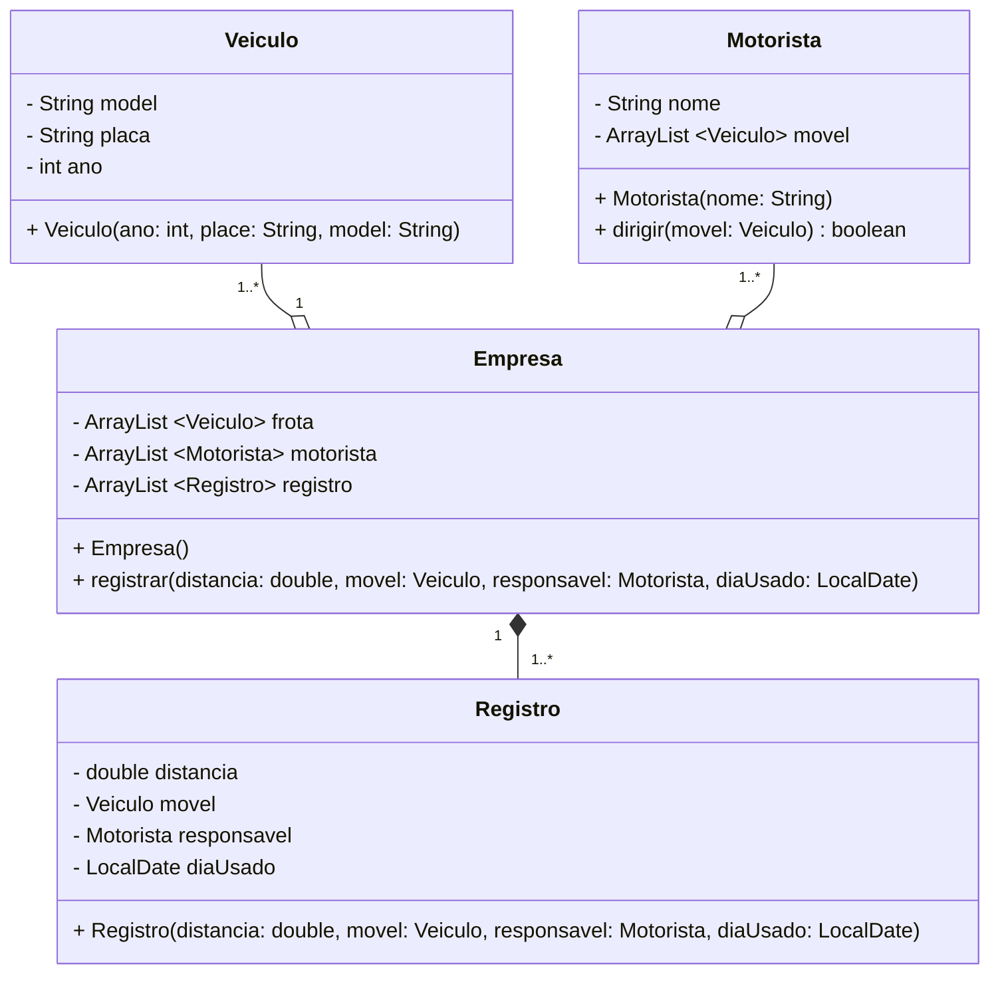

Uma empresa possui uma frota de veículos. Cada veículo tem um modelo, uma placa e um ano de fabricação. A empresa tem vários motoristas, e cada motorista pode dirigir um ou mais veículos. A empresa registra o uso de cada veículo, incluindo a data, o motorista e a distância percorrida

