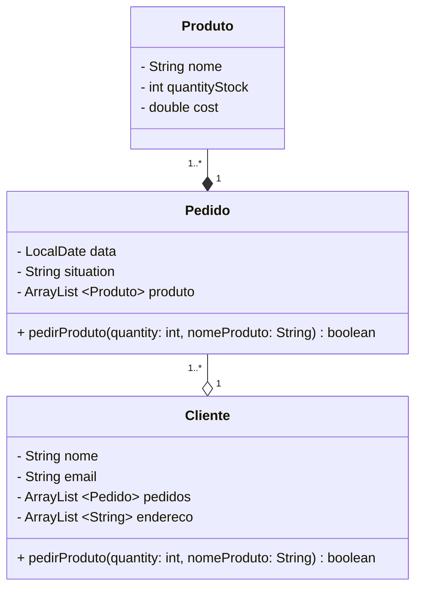

Cliente pedirá 1 ou mais produtos, será removido isso do stock e retorna boolean para se foi feito ou não

```mermaid
classDiagram
    class Produto{
        - String nome
        - int quantityStock
        - double cost
    }
    Produto "1..*"--*"1" Pedido
    Pedido "1..*"--o"1" Cliente
    class Cliente{
        - String nome
        - String email
        - ArrayList ~Pedido~ pedidos
        - ArrayList ~String~ endereco
        + pedirProduto (quantity: int, nomeProduto: String) boolean
    }
    class Pedido{
        - LocalDate data
        - String situation
        - ArrayList ~Produto~ produto
        + pedirProduto (quantity: int, nomeProduto: String) boolean
    }
```