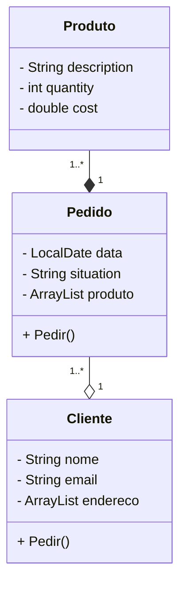

```mermaid
classDiagram
    class Produto{
        - String description
        - int quantity
        - double cost
    }
    Produto "1..*"--*"1" Pedido
    Pedido "1..*"--o"1" Cliente
    class Cliente{
        - String nome
        - String email
        - ArrayList <String> endereco
        + Pedir ()
    }
    class Pedido{
        - LocalDate data
        - String situation
        - ArrayList <Produto> produto
        + Pedir ()
    }
```