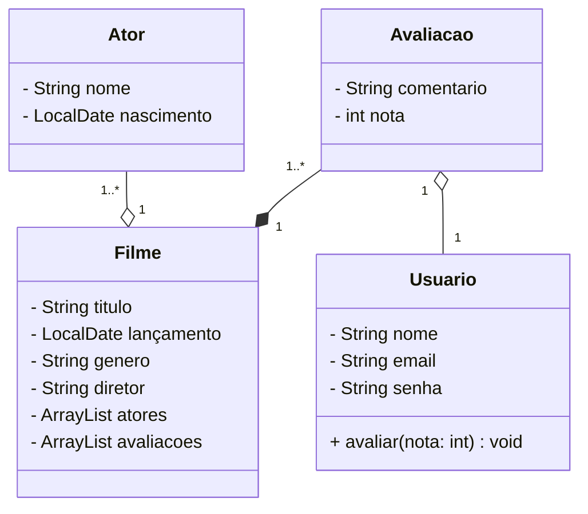

```mermaid
classDiagram
    class Filme{
        - String titulo
        - LocalDate lançamento
        - String genero
        - String diretor
        - ArrayList <Ator> atores
        - ArrayList<Avaliacao> avaliacoes
    }
    class Ator{
        - String nome
        - LocalDate nascimento
    }
    class Avaliacao{
        - String comentario
        - int nota
    }
    Ator "1..*"--o"1" Filme
    Avaliacao "1..*"--*"1" Filme
    Avaliacao "1"o--"1" Usuario
    class Usuario{
        - String nome
        - String email
        - String senha
        + avaliar(nota: int) void
    }
```