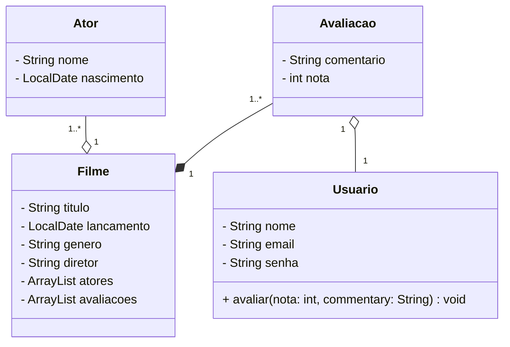

Um ator tem um nome e uma data de nascimento. Um filme pode ter uma ou mais avaliações, e cada avaliação está associada a um único filme e a um único usuário. Um usuário tem um nome, um e-mail e uma senha. Um usuário pode avaliar um ou mais filmes.