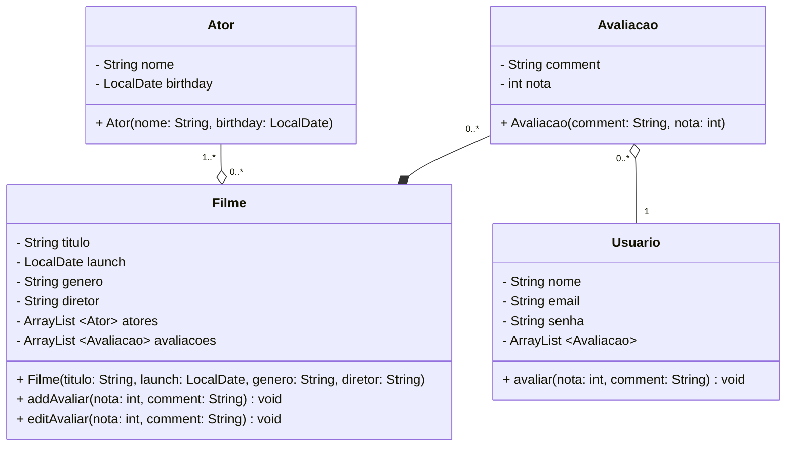

```mermaid
classDiagram
    class Filme{
        - String titulo
        - LocalDate launch
        - String genero
        - String diretor
        - ArrayList ~Ator~ atores
        - ArrayList ~Avaliacao~ avaliacoes
        + Filme(titulo: String, launch: LocalDate, genero: String, diretor: String)
        + addAvaliar(nota: int, comment: String) void
        + editAvaliar(nota: int, comment: String) void
    }
    class Ator{
        - String nome
        - LocalDate birthday
        + Ator (nome: String, birthday: LocalDate)
    }
    class Avaliacao{
        - String comment
        - int nota
        + Avaliacao (comment: String, nota: int)
    }
    Ator "1..*" --o "0..*" Filme
    Avaliacao "0..*" --* "1" Filme
    Avaliacao "0..*" o-- "1" Usuario

    class Usuario{
        - String nome
        - String email
        - String senha
        - ArrayList ~Avaliacao~
        + avaliar(nota: int, comment: String) void
    }
```