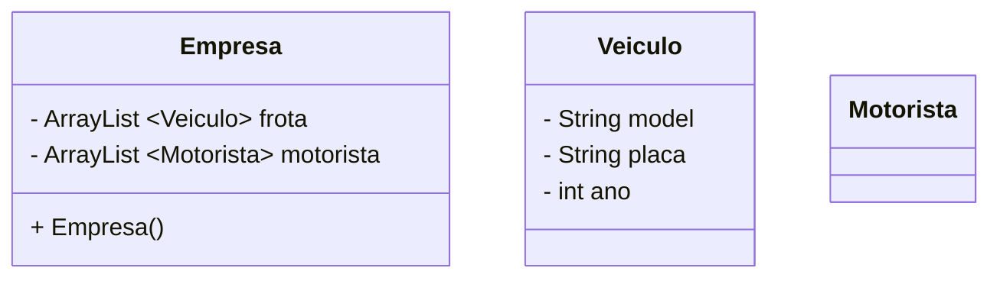

Motorista pode dirigir um ou mais veículos. A empresa registra o uso de cada veículo, incluindo a data, o motorista e a distância percorrida.

```mermaid
classDiagram
    class Empresa{
        - ArrayList ~Veiculo~ frota
        - ArrayList ~Motorista~ motorista
        + Empresa ()
    }
    class Veiculo{
        - String model
        - String placa
        - int ano
    }
    class Motorista{
        
    }
```