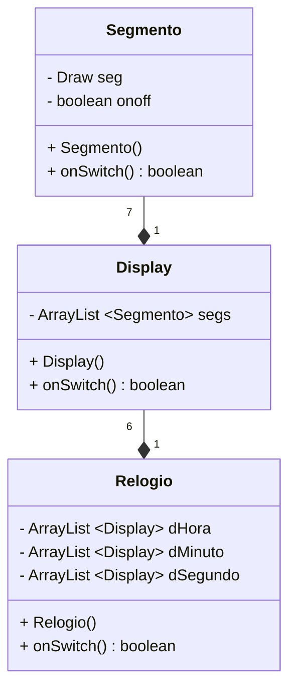

```mermaid
classDiagram
    class Relogio{
        + Relogio ()
        - ArrayList ~Display~ dHora
        - ArrayList ~Display~ dMinuto
        - ArrayList ~Display~ dSegundo
        + onSwitch () boolean
    }
    class Display{
        + Display ()
        - ArrayList ~Segmento~ segs
        + onSwitch () boolean
    }
    class Segmento{
        - Draw seg
        - boolean onoff
        + Segmento ()
        + onSwitch () boolean
    }
    Display "6"--*"1" Relogio
    Segmento "7"--*"1" Display
```
-a-

f-b

-g-

e-c

-d-