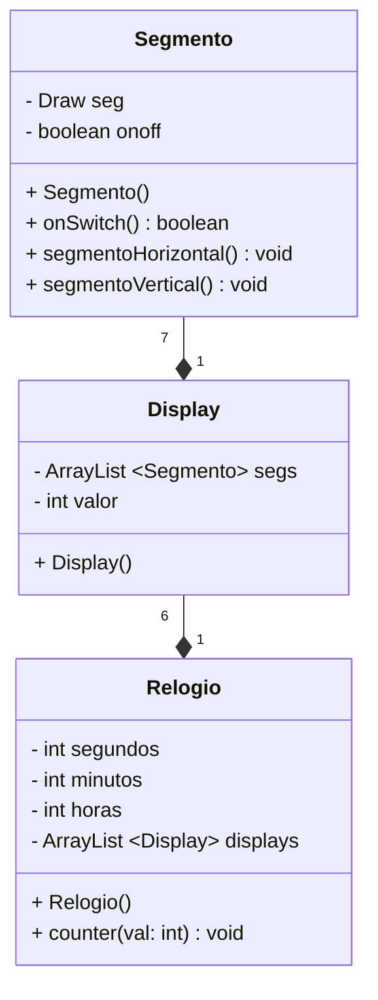

```mermaid
classDiagram
    class Relogio{
        + Relogio ()
        + counter (val: int) void 
        - int segundos
        - int minutos
        - int horas
        - ArrayList ~Display~ displays
    }
    class Display{
        + Display ()
        - ArrayList ~Segmento~ segs
        - int valor
    }
    class Segmento{
        - Draw seg
        - boolean onoff
        + Segmento ()
        + onSwitch () boolean
        + segmentoHorizontal () void
        + segmentoVertical () void
    }
    Display "6"--*"1" Relogio
    Segmento "7"--*"1" Display
```