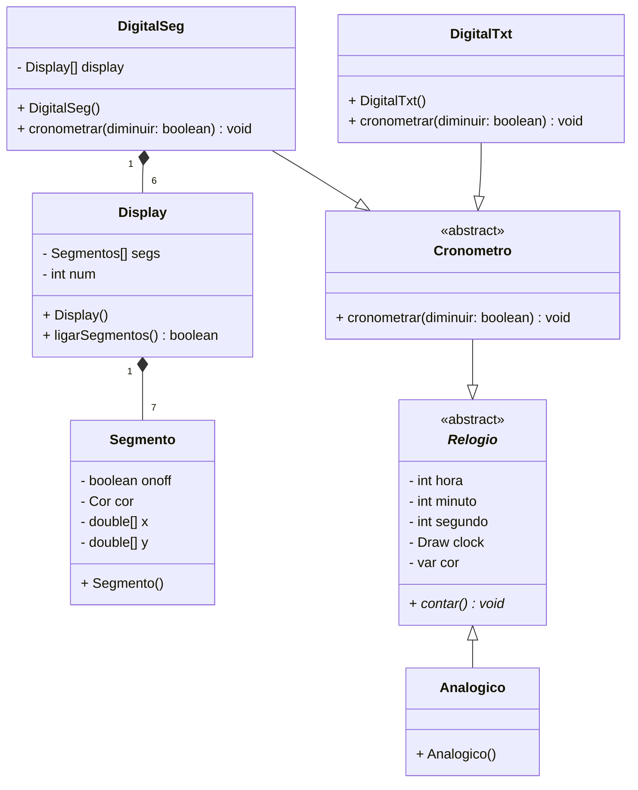

```mermaid
classDiagram
    class _Relogio_{
        <<abstract>>
        - int hora
        - int minuto
        - int segundo
        - Draw clock
        - var cor
        + _contar () void_
    }
    class DigitalSeg{
        - Display[] display
        + DigitalSeg ()
        + cronometrar (diminuir: boolean) void
    }
    class Display{
        - Segmentos[] segs
        - int num
        + Display ()
        + ligarSegmentos () boolean
    }
    class Segmento{
        - boolean onoff
        - Cor cor
        - double[] x
        - double[] y
        + Segmento ()
    }
    class Analogico{
        + Analogico ()
    }
    class DigitalTxt{
        + DigitalTxt ()
        + cronometrar (diminuir: boolean) void
    }

    Display "1"*--"7"Segmento
    DigitalSeg "1"*--"6" Display
    Cronometro --|> _Relogio_
    DigitalSeg--|>Cronometro
    DigitalTxt--|>Cronometro
    _Relogio_ <|-- Analogico
    class Cronometro{
        <<abstract>>
        + cronometrar (diminuir: boolean) void
        }
```