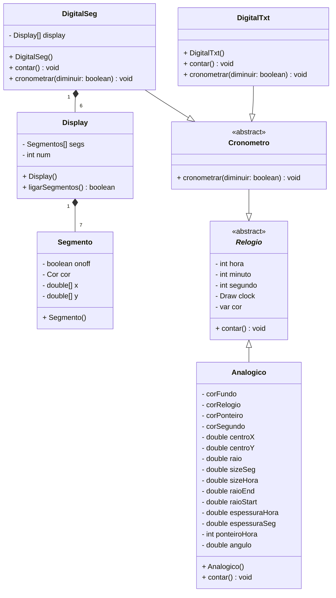

```mermaid
classDiagram
    class _Relogio_{
        <<abstract>>
        - int hora
        - int minuto
        - int segundo
        - Draw clock
        - var cor
        + contar () void
    }
    class DigitalSeg{
        - Display[] display
        + DigitalSeg ()
        + contar () void
        + cronometrar (diminuir: boolean) void
    }
    class Display{
        - Segmentos[] segs
        - int num
        + Display ()
        + ligarSegmentos () boolean
    }
    class Segmento{
        - boolean onoff
        - Cor cor
        - double[] x
        - double[] y
        + Segmento ()
    }
    class Analogico{
        - corFundo
        - corRelogio
        - corPonteiro
        - corSegundo
        - double centroX
        - double centroY
        - double raio
        - double sizeSeg
        - double sizeHora
        - double raioEnd
        - double raioStart
        - double espessuraHora
        - double espessuraSeg
        - int ponteiroHora
        - double angulo
        + Analogico ()
        + contar () void
    }
    class DigitalTxt{
        + DigitalTxt ()
        + contar () void
        + cronometrar (diminuir: boolean) void
    }

    Display "1"*--"7"Segmento
    DigitalSeg "1"*--"6" Display
    Cronometro --|> _Relogio_
    DigitalSeg--|>Cronometro
    DigitalTxt--|>Cronometro
    _Relogio_ <|-- Analogico
    class Cronometro{
        <<abstract>>
        + cronometrar (diminuir: boolean) void
        }
```