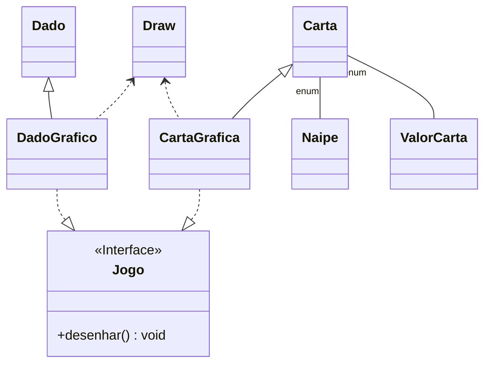

```mermaid
classDiagram
    Dado <|-- DadoGrafico
    Draw <.. CartaGrafica
    Carta <|-- CartaGrafica
    Carta "enum"-- Naipe
    Carta "enum"-- ValorCarta
    Draw <.. DadoGrafico
    class Jogo{
        <<Interface>>
        +desenhar () void
    }
    DadoGrafico..|>Jogo
    CartaGrafica..|>Jogo
```